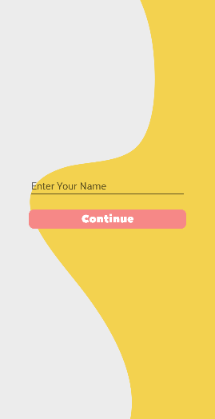
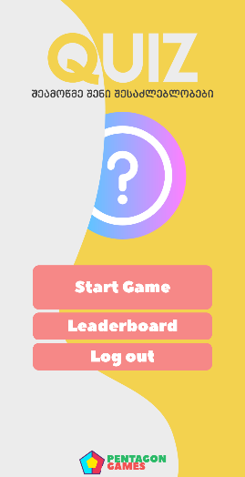
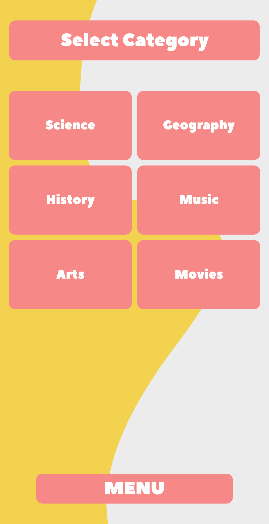
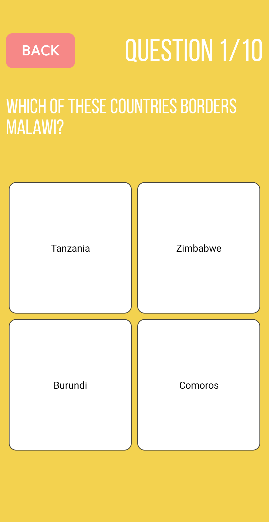
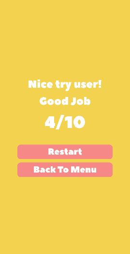
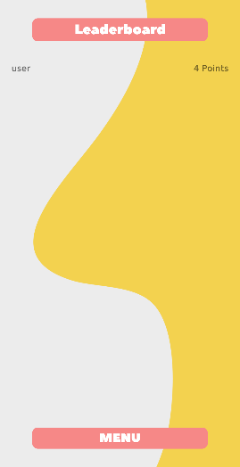

# Quiz

Android Quiz application which aims to entertain and educate people. App covers 6 different topics: Science, Geography, History, Music, Arts and Movies. You can challenge yourself in one of them. Each quiz contains 10 questions. With questions you have four possible answers in which one of them is correct. You are successful if you answer 3 or more questions correctly. In this case number of correct answers adds to the general points which you have collected. You can view different users with their points in leaderboard.

### Table of Contents

- [Tech Stack](#tech-stack)
- [Used Resources](#used-resources)
- [Application Flow](#application-flow)

#

### Tech Stack

-  [Kotlin](https://kotlinlang.org/) - Programming language
-  [Retrofit](https://square.github.io/retrofit/) - HTTP client for Android and Java
- [Room](https://developer.android.com/training/data-storage/room) - Abstraction layer library over SQLite DB

#

### Used resources

- [the-trivia-api](https://the-trivia-api.com/api/) - API for quiz questions

#

### Application Flow

1\. First of all you need to enter your username.

2\. Then you are redirected to menu page from where you can start game, view leaderboard or logout. Lets start the game.

3\. Choose category of the questions.

4\. The game starts.

5\. After 10 questions quiz ends.

6\. You can view your accumulated points in leaderboard.

